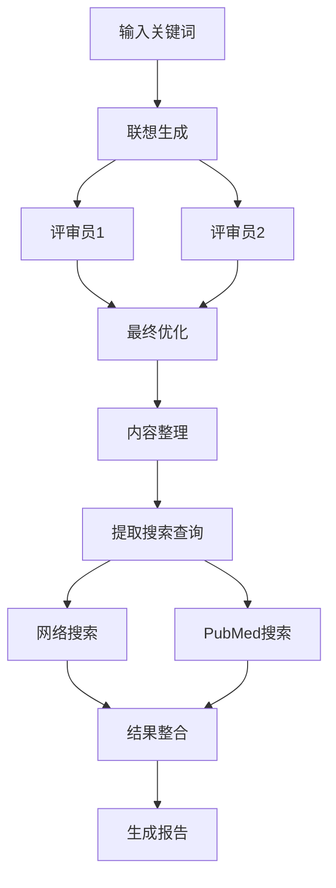

# AI驱动的研究工作流 (本地化版本)

这是一个本地化的Python程序，复制了n8n工作流的功能，实现了AI驱动的智能研究助手。程序通过多阶段LLM处理和自动化网络搜索，为用户提供全面的研究框架和相关资料。

## 功能特性

### 🤖 多阶段AI处理
- **阶段1**: 联想生成 - 根据关键词生成9个维度的联想
- **阶段2**: 双重评审 - 两个LLM并行评审研究框架
- **阶段3**: 最终优化 - 整合评审意见，优化研究框架
- **阶段4**: 内容整理 - 格式化输出，准备搜索查询

### 🔍 多源搜索
- **网络搜索**: 支持DuckDuckGo和Bing搜索
- **学术搜索**: 集成PubMed医学文献搜索
- **批量处理**: 自动对所有查询进行搜索
- **结果整合**: 统一格式化所有搜索结果

### 📊 智能输出
- **实时进度**: 丰富的控制台界面和进度显示
- **结果保存**: JSON格式保存详细数据
- **研究报告**: 自动生成Markdown格式报告
- **搜索摘要**: 表格形式展示搜索统计

## 安装指南

### 1. 环境要求
- Python 3.8+
- pip包管理器

### 2. 克隆项目
```bash
git clone <repository-url>
cd ai-research-workflow
```

### 3. 安装依赖
```bash
pip install -r requirements.txt
```

### 4. 配置环境变量
复制配置文件：
```bash
cp .env.example .env
```

编辑`.env`文件，配置必要的API密钥：
```bash
# Google Gemini API配置 (推荐)
GEMINI_API_KEY=your_gemini_api_key_here
GEMINI_MODEL=gemini-1.5-flash

# 或者使用OpenAI API
# OPENAI_API_KEY=your_openai_api_key_here
# OPENAI_MODEL=gpt-4o-mini

# 搜索配置
SEARCH_DELAY=1
MAX_SEARCH_RESULTS=10
PUBMED_EMAIL=your_email@example.com
```

## 使用说明

### 基本用法
```bash
python main.py "人工智能"
```

### 命令行选项
```bash
python main.py --help
```

- `--no-save`: 不保存结果到文件
- `--details`: 显示详细搜索结果
- `--config-check`: 检查配置是否正确

### 示例命令
```bash
# 基本研究
python main.py "机器学习"

# 显示详细结果
python main.py "深度学习" --details

# 不保存结果
python main.py "神经网络" --no-save

# 检查配置
python main.py --config-check "test"
```

## 配置选项

### LLM配置
支持三种LLM配置方式：

#### 1. Google Gemini API (推荐)
```env
GEMINI_API_KEY=your_gemini_api_key
GEMINI_MODEL=gemini-1.5-flash
```

#### 2. OpenAI API
```env
OPENAI_API_KEY=your_api_key
OPENAI_MODEL=gpt-4o-mini
OPENAI_BASE_URL=https://api.openai.com/v1
```

#### 3. 本地LLM (如Ollama)
```env
LOCAL_LLM_URL=http://localhost:11434/v1
LOCAL_LLM_MODEL=llama3:latest
```

### 搜索配置
```env
SEARCH_DELAY=1              # 搜索间隔(秒)
MAX_SEARCH_RESULTS=10       # 每个查询的最大结果数
PUBMED_EMAIL=your@email.com # PubMed API要求的邮箱
```

## 输出文件

程序会在`results/`目录下生成以下文件：

### 1. 研究数据 (JSON)
```
results/research_关键词_20231201_143022.json
```
包含完整的研究数据，包括LLM输出和搜索结果。

### 2. 研究报告 (Markdown)
```
results/report_关键词_20231201_143022.md
```
格式化的研究报告，包含研究框架和搜索结果摘要。

## 工作流程



## 故障排除

### 1. OpenAI API错误
```bash
# 检查API密钥
python main.py --config-check test

# 常见错误：
# - API密钥无效
# - 配额超限
# - 网络连接问题
```

### 2. 搜索失败
```bash
# 检查网络连接
# 确认PubMed邮箱配置正确
# 调整搜索延迟设置
```

### 3. 依赖问题
```bash
# 重新安装依赖
pip install -r requirements.txt --force-reinstall
```

## 项目结构

```
ai-research-workflow/
├── config.py           # 配置管理
├── llm_client.py       # LLM客户端和工作流
├── search_client.py    # 搜索客户端
├── main.py            # 主程序
├── requirements.txt   # Python依赖
├── .env.example      # 配置示例
├── README.md         # 项目说明
└── results/          # 输出目录
```

## 贡献指南

1. Fork项目
2. 创建特性分支
3. 提交变更
4. 创建Pull Request

## 许可证

MIT License

## 支持

如有问题，请创建Issue或联系开发者。

---

## 原始n8n工作流对比

| 功能 | n8n工作流 | 本地化版本 |
|------|-----------|------------|
| LLM处理 | 5个Google Gemini节点 | 支持OpenAI/本地LLM |
| 搜索引擎 | DuckDuckGo | DuckDuckGo + Bing |
| 学术搜索 | 无 | PubMed集成 |
| 批量处理 | 支持 | 支持 |
| 结果保存 | JSON | JSON + Markdown报告 |
| 界面 | n8n图形界面 | 命令行界面 |
| 部署 | 需要n8n服务器 | 本地运行 |

这个本地化版本提供了更多的灵活性和功能，同时保持了原始工作流的核心逻辑。